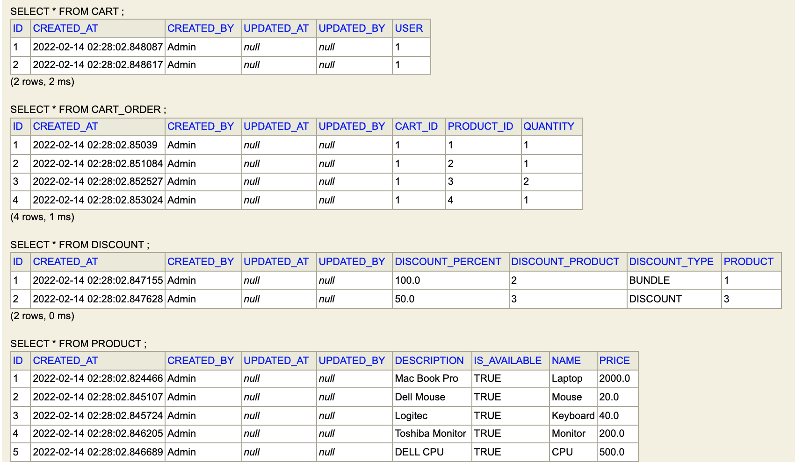
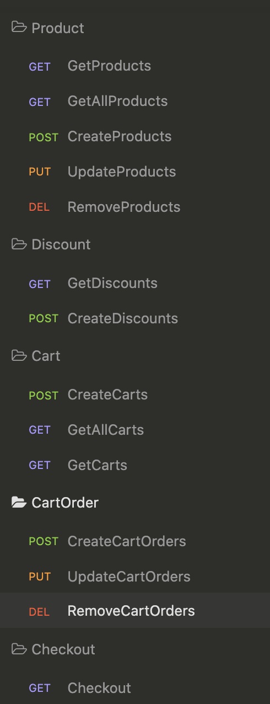
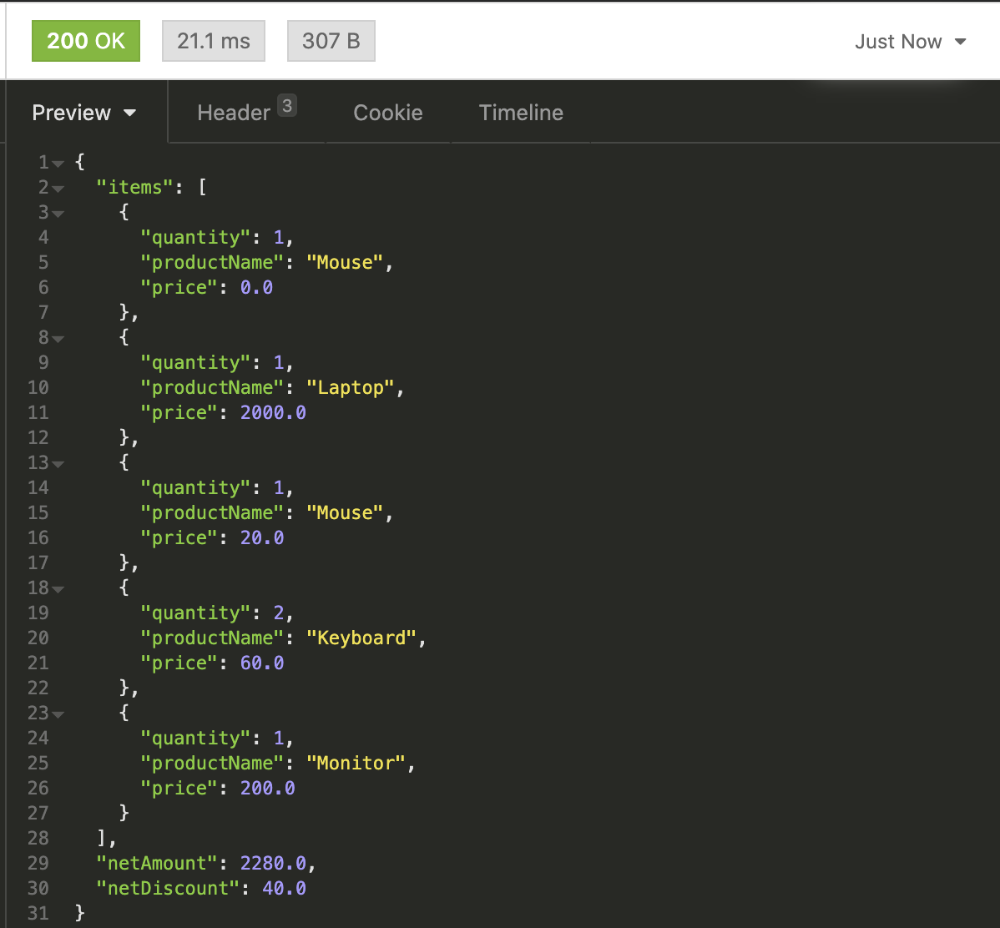
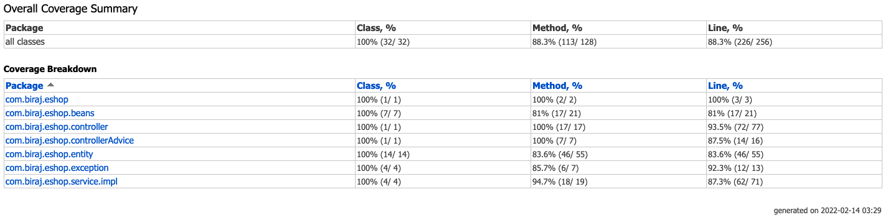

# EShop - Product and Cart checkout implementation 

### Preface:
This application is developed on top of Spring boot and H2 in memory DB.
 
### Assumption:
1. This application focuses only on the feature of performing CRUD operations on Product and Cart ordering with simple rule based discount feature
2. Hence, it is assumed the other modules like AuthN and AuthZ, metrics, User table and etc are taken care.
3. For Discount 2 type of deals are provided  
    3.1 Discount deal -> Buy one item , get 50%(configurable in database) off on second purchase. 
          -> If One item is bought, then no discount will be given.  
    3.2 Bundle Deal -> One item free with another Item.  
          -> If one item is bought, if it is configured with a free item. then free item will be added to the Final Bill
4. This application exposes the rest endpoints for all above CRUD operations, a front end application call over the network. For the sake of this application Insomnia is used and checked in along with the source code [Insomnia-API-Spec.json] 
5. This application is hosted on HTTP, if needed can be hosted on HTTPS.
6. Open API specifications can be exposed if needed.
7. With H2 db all scripts are already used already used to populate the tables as shown in below screenshot.  

8. Usage:
   - Create Product 
   - Create Discount for the Product
   - Create a cart
   - Add order to the Cart
   - Checkout  
  

9.Checkout feature calculated the total Bill with items and returns in JSON format Showing All Items, Quantity, Amount and Discount Amount  

10. Junit test cases are used to ensure atmost code coverage with both positive and negative scenarios.  

### Out Of Scope:
- Logging
- Continuous Integration
- Deployment
- Metrics
